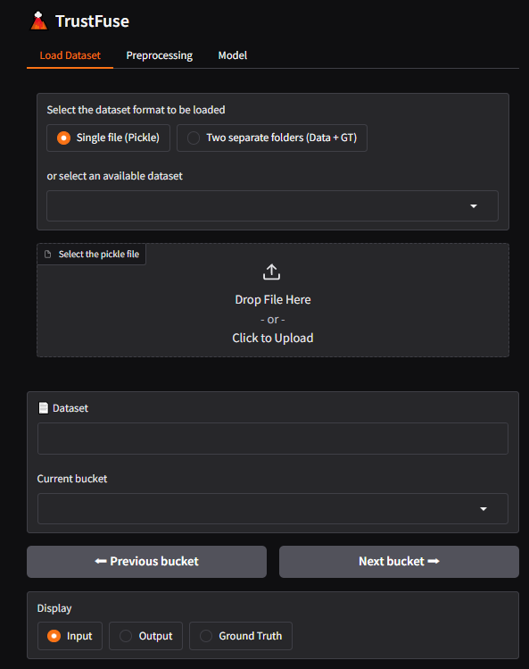
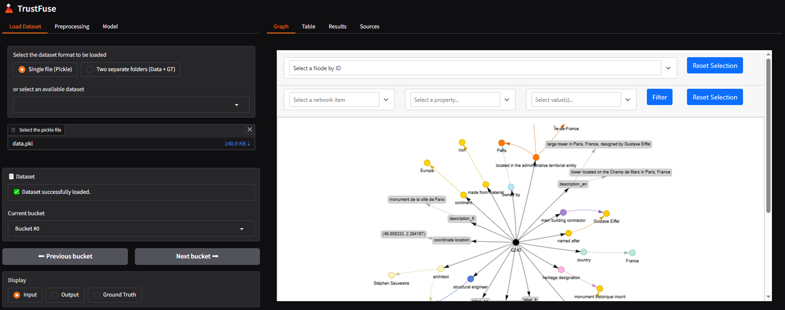
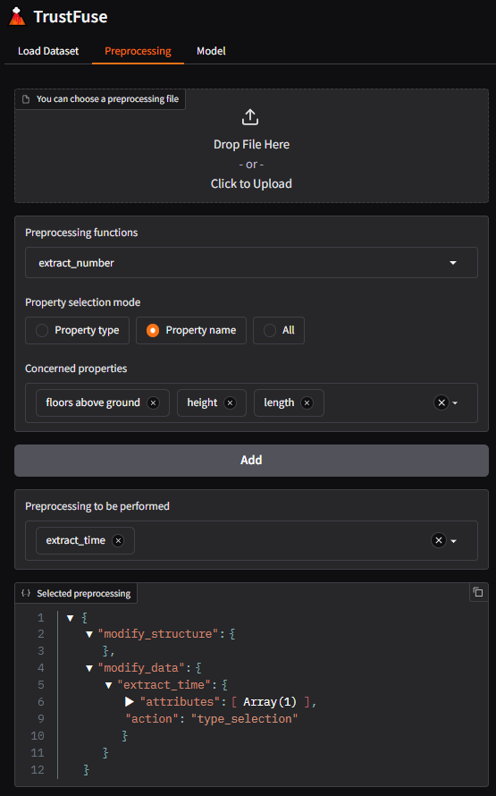
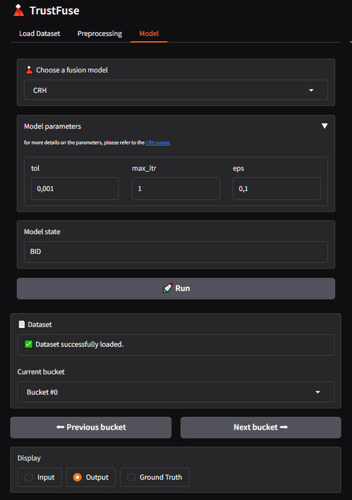

## :volcano: TrustFuse UI

To use TrustFuse, you can use a user interface created with [Gradio](https://www.gradio.app/).
To do this, simply run the following command at the root of this project:

```
python app.py
```

Before to perform the fusion task, you need complete three steps:

1. Dataset loading
2. Dataset preprocessing
3. Selecting the fusion model

### 1. Load dataset

There are two ways to load the dataset: 

* Load a single pickle file
* Or you can load two folders with one file per bucket, one folder for conflicting data and a second folder for correct values. If the order of your files is important in the process of fusion and evaluating the reliability of data sources, make sure you provide an order to your files by naming them with numbers (chronological order) or by date with the following format ``yyyymmdd``. If you do this, TrustFuse will assign the correct order when loading the dataset.




#### 1.bis Exploring the data

Once the dataset has been loaded, data from the first bucket in the dataset is displayed by default. To navigate between buckets, you can use the ``Previous`` and ``Next`` buttons, or a dropdown menu to navigate between buckets and update the interface visualization.
You can explore data via:

* an interactive graph with filters to focus on attributes of interest
* in tabular form, but for the WikiConflict dataset this visualization is not relevant since a source rarely provides values for all properties, resulting in a sparse table.
* for WikiConflict, a mini-graph visualization displays the partial orders existing in the bucket being explored.



### 2. Dataset preprocessing

For this step, you can either load a file containing the preprocessing functions to be performed, or you can select them directly in the UI, where different preprocessing functions are available.



### 3. Start the fusion process

You can choose one of the implemented fusion models in TrustFuse, or implement your own.
Once you have selected the template, run it via the :rocket: ``Run`` button, and the results of the fusion will be displayed dynamically by default. You can then navigate between buckets already processed in the same way as explained above, but also navigate between input or output buckets via the ``Display`` box.


